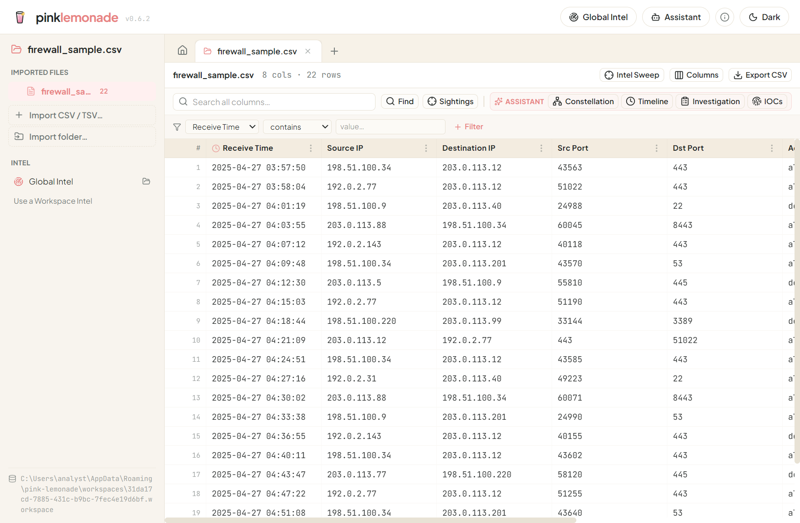
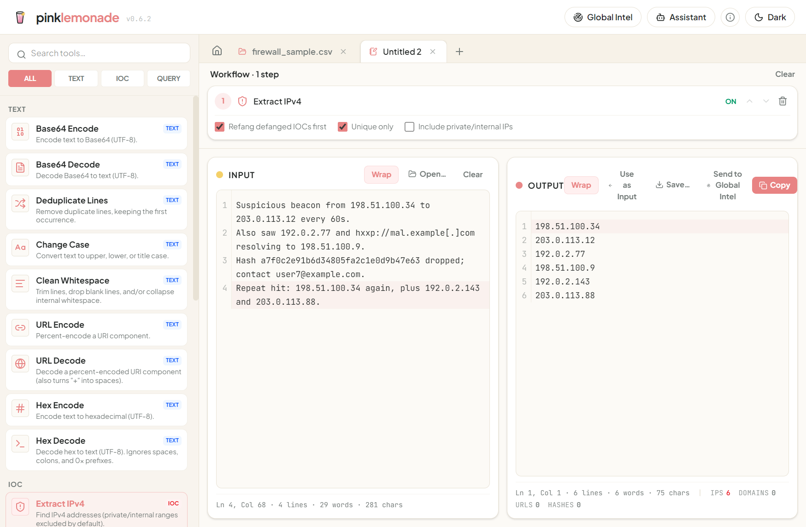

<p align="center">
  
</p>

<h1 align="center">pink-lemonade</h1>

<p align="center"><strong>A desktop toolkit for cybersecurity investigation and data wrangling.</strong></p>

pink-lemonade handles the messy middle of an investigation — the parsing, cleanup, and
pivoting you do between your bigger tools: pull indicators out of text, clean up exports, work
through big CSV/TSV timelines (Splunk exports, plaso timelines, EVTX dumps, firewall logs), and
hunt them for known indicators — all in one place instead of juggling Notepad++ and a stack of
single-purpose tools.

Built with **Electron + React + TypeScript**. The database runs in a worker thread, so even
multi-GB files and full-column scans never freeze the UI.

<p align="center">
  
</p>

---

## What it does

### 📝 Notepad — text transforms
Paste text and run it through a chain of small tools: Base64/hex decode, IPv4 & IOC extraction,
defang/refang, dedupe lines, whitespace/case cleanup, and **query builders** (CQL / KQL / SPL).
Each tool feeds the next, so you build a pipeline and watch the output update live; steps can be
toggled on/off. Per-pane find (Ctrl+F) with highlight-and-step.

<p align="center">
  
</p>

### 🗂️ Workspaces — data investigation
Import one or more CSV/TSV files into a workspace and explore them in a fast, virtualized grid
that scales to millions of rows / multi-GB files:

- **Sort, resize, reorder, and show/hide columns**; search with highlight + step.
- **Filters**: contains / not-contains / equals / ≠, multi-value (`∈`), inclusive **and exclusive**
  facets, and time ranges.
- **Distinct values** panel with live progress + cancel; export values to a notepad.
- **Time pivots** — right-click a timestamp → ±N window, keeping your anchor row in view.
- **Tagging** — mark rows Malicious / Suspicious / Unknown / Benign (single, multi-row, or
  bulk-by-filter), see colored markers, and filter by tag (include or exclude). Tags persist in
  the workspace file.
- **Export** the current view (filters/search/sort, visible columns) back out to CSV.

### 🎯 Intel Sweep — hunt for known indicators
Sweep a source for a known intel set (paste a list, load a **watchlist**, or open a `.txt`/`.csv`)
and mark every matching row as a **sighting**. Matching is case-insensitive containment —
whole-token for IPs / hashes / file names, substring for domains — so `8.8.8.8` is found inside
`explorer.exe connected to 8.8.8.8`. Sightings get a crosshair marker and a highlighted cell; the
**Sightings panel** rolls them up by indicator so you can zero in, exclude, or clear false positives.

### 🌐 Intel / Enrichment — context lookups
A provider-agnostic enrichment surface over an app-wide cache (a lookup is never repeated). Ships
with **MaxMind GeoIP** (a local `.mmdb`) and **VirusTotal** (bring your own key) — IP / domain /
hash reputation with a colored **Malicious / Suspicious / Clean / Unknown** verdict, quota-aware
pacing, and protected re-lookups (your key is stored encrypted, never in plaintext). Results land in
a sortable Intel grid. Curate **watchlists** (IP / CIDR / ASN / domain / hash) for context, and pivot
both ways — **send a cell or column to Intel**, or right-click indicators in the Intel grid to **run
a sweep** against any open workspace source.

### 🤖 AI assistant — a grounded Claude analyst
An embedded **Claude** analyst that operates the open workspace — it searches your sources, correlates
across them and over time, reads the intel cache, and records what it concludes into clickable review
surfaces: an **Artifact Constellation** (events/TTPs backed by the exact corroborating rows, with MITRE
ATT&CK + user attribution), a curated **Timeline**, an **IOC catalog**, and a resumable **investigation
plan** — plus ✨ marks on the exact rows that back each claim. It's **grounded**: it calls the app's
real tools (SQL layer, intel cache, classifiers) for every fact instead of guessing, and data-changing
actions (tagging, grouping) need your approval. It runs on **your own Claude Code login** — your Claude
subscription, no API key (Claude Code must be installed and signed in).

> Extract structured fields, too: pull scalar sub-fields out of a JSON column (e.g. O365 `AuditData`,
> Hayabusa `Details`) into new first-class grid columns you can filter, sort, sweep, and tag.

→ **User guide:** [forynsics.github.io/pink-lemonade](https://forynsics.github.io/pink-lemonade/) (or the [`docs/`](docs/README.md) source)

---

## Download

Grab the latest **portable `.exe`** from the [Releases](../../releases) page — double-click to
run, no installation. (It's currently **unsigned**, so Windows SmartScreen shows a *"More info →
Run anyway"* prompt the first time.) Your workspaces and settings are stored under
`%APPDATA%\pink-lemonade` and persist across runs.

---

## Develop

Requirements: **Node.js 18+** and npm.

```bash
git clone https://github.com/forynsics/pink-lemonade.git
cd pink-lemonade
npm install
npm run dev          # launch the app with hot reload
```

### Scripts

```bash
npm run dev          # dev server + Electron window (HMR)
npm test             # unit tests (Vitest)
npm run typecheck    # type-check main/preload + renderer
npm run build        # production bundle to out/
npm run dist         # build + package the portable Windows .exe into dist/
```

---

## Project layout

```
src/
  main/        Electron main process — window + IPC; the DB runs in a worker thread
    csv/       SQLite-backed CSV/workspace engine + Intel Sweep (db.ts, worker.ts, sql.ts, sweep.ts)
    enrich/    enrichment engine + cache, MaxMind + VirusTotal providers, watchlists
    ai/        the grounded AI assistant — Claude Code runner + the grounding tools it calls
  preload/     contextBridge surface exposed to the renderer (window.api)
  renderer/    React UI (tools palette, notepad, CSV grid, Intel grid, AI panel, sidebars)
    src/tools/ the text-transform tool registry (pure functions)
docs/          user guide + screenshots
```

The renderer is sandboxed (no Node access); all file/DB and network work happens in the main
process over a small IPC surface.

---

## License

[MIT](LICENSE) © forynsics
