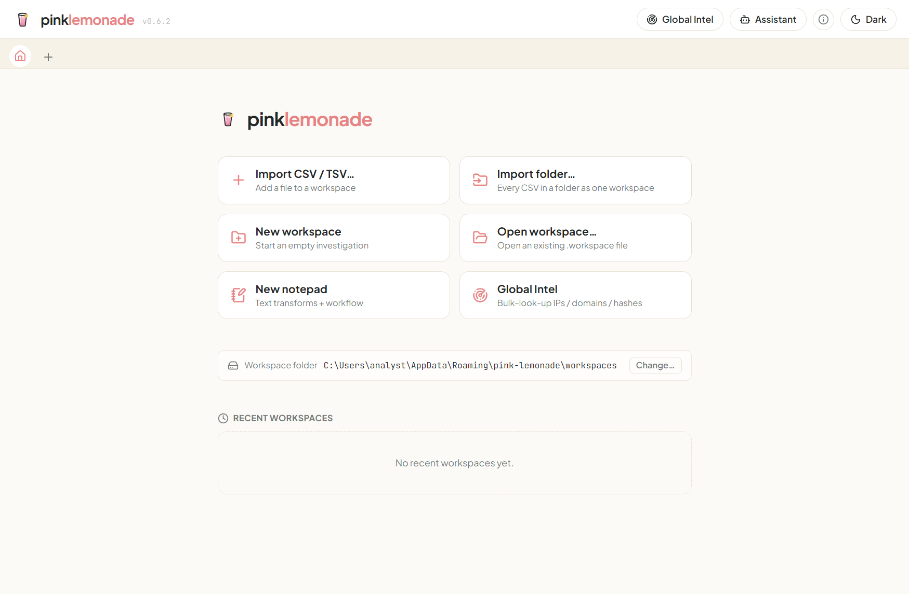

# Getting started

## Launching

pink-lemonade ships as a **portable `.exe`** — download it from the Releases page and double-click
to run, no installation. (It’s unsigned, so Windows SmartScreen may ask you to confirm with
*More info → Run anyway* the first time.) It opens on the **Home screen** with no tabs — you choose
what to do first. Your work is saved under `%APPDATA%\pink-lemonade` and comes back next launch.

## The Home screen

  

Home is your launchpad. From here you can:

- **Import CSV / TSV…** — pick a tabular file; it opens in a new workspace as your first source.
- **New workspace** — start an empty workspace and import files into it later.
- **Open workspace…** — reopen a `.workspace` file you saved before.
- **New notepad** — a blank text scratchpad for transforms.
- **Global Intel** — the [Intel tab](intel.md): bulk-look-up IPs / domains / hashes and keep
  watchlists.

Below the actions, **Recent workspaces** lists what you’ve opened lately — click one to jump
straight back in (tags and all).

You can return to Home anytime with the **🏠 Home** button at the top-left of the tab bar.

## The top bar

The header is always available, wherever you are:

- **Global Intel** — opens the [Intel tab](intel.md) (bulk lookups + watchlists).
- **Assistant** — opens the [AI assistant](ai.md), a grounded Claude analyst that works the open
  workspace with you.
- **Light / Dark** — theme toggle (remembered).

## Tabs

Each notepad and each workspace is a **tab**, like a browser. The `+` button opens a new
notepad. Tabs persist — close the app and your tabs (and their contents) come back next time.

- **Double-click a tab** to rename it.
- **Click the ✕** on a tab to close it. Closing the last tab returns you to Home.

## Your first notepad

Click **New notepad**, paste some text into the left pane, and pick a tool from the palette on
the left (for example, *Extract IPv4*). The result appears in the right pane. Add more tools to
build a chain.

→ [More on the notepad](notepad.md)

## Your first import

Click **Import CSV / TSV…** and choose a file. It loads into a workspace and you’re dropped into
the data grid. The left sidebar shows the file you imported; the main area is the spreadsheet view.

→ [More on workspaces](workspaces.md) and [exploring data](exploring-data.md)

## Light & dark

Use the **Light / Dark** toggle at the top-right to switch themes. Your choice is remembered.
